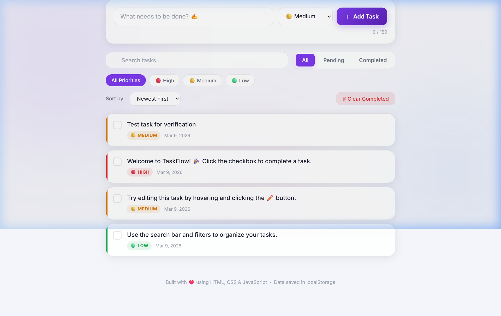

# ⚡ TaskFlow — Advanced To-Do List App

> A feature-rich, beautifully designed **To-Do List web application** built with pure HTML, CSS, and JavaScript — no frameworks, no build tools, just open and go!



---

## 📁 Project Structure

```
CodeAplha_TodoList/
├── index.html          # Main HTML file
├── preview.png         # App screenshot
├── README.md           # Project documentation
├── css/
│   └── style.css       # Styles, themes & animations
└── js/
    └── script.js       # Task management logic
```

---

## ✨ Features

| Feature | Details |
|---|---|
| **Add Tasks** | Type a description, pick a priority, press Add |
| **Edit Tasks** | Click the ✏️ button on any task to open the edit modal |
| **Delete Tasks** | Click the 🗑️ button; task animates out |
| **Complete Tasks** | Click the checkbox to mark done/pending |
| **Task Priority** | High 🔴, Medium 🟡, Low 🟢 — shown as colored badges and left-border indicators |
| **Task Counter** | Live stats: Total, Completed, Pending |
| **Progress Bar** | Animated progress showing % completion |
| **Search** | Real-time search filtering across all tasks |
| **Status Filter** | Tabs for All / Pending / Completed |
| **Priority Filter** | Pills to filter by High / Medium / Low |
| **Sort** | Sort by Newest, Oldest, Priority, or Name |
| **Clear Completed** | One-click removal of all completed tasks |
| **localStorage** | All tasks and theme preference persist across page reloads |
| **Dark / Light Theme** | Toggle with the 🌙 / ☀️ button in the header |
| **Responsive** | Fully usable on mobile, tablet, and desktop |

---

## 🎨 Design Highlights

- **Glassmorphism** cards with backdrop blur
- **Animated gradient** background blobs
- **Gradient** brand name and accent colors
- **Smooth animations** for task entry, exit, modal, and toasts
- **Custom scrollbar** styled to match the theme
- **Toast notifications** for every action (add, edit, delete, complete)

---

## 🚀 Getting Started

No build tools required. Simply open `index.html` in any modern browser:

```bash
# Option 1: Double-click index.html in File Explorer
# Option 2: Use VS Code Live Server extension (recommended)
```

---

## 🛠️ Tech Stack

| Layer | Technology |
|---|---|
| **Structure** | HTML5 — Semantic, ARIA-accessible markup |
| **Styling** | CSS3 — Custom properties, glassmorphism, keyframe animations, Grid & Flexbox |
| **Logic** | JavaScript ES6+ — Event delegation, `localStorage` API, DOM manipulation |

---

## 📝 Notes

- Tasks are stored in `localStorage` under the key `taskflow_tasks`
- Theme preference is stored under `taskflow_theme`
- Three demo tasks are seeded on first load to showcase the UI
- All user input is HTML-escaped to prevent XSS

---

*Made with ❤️ — CodeAlpha Internship Project*
